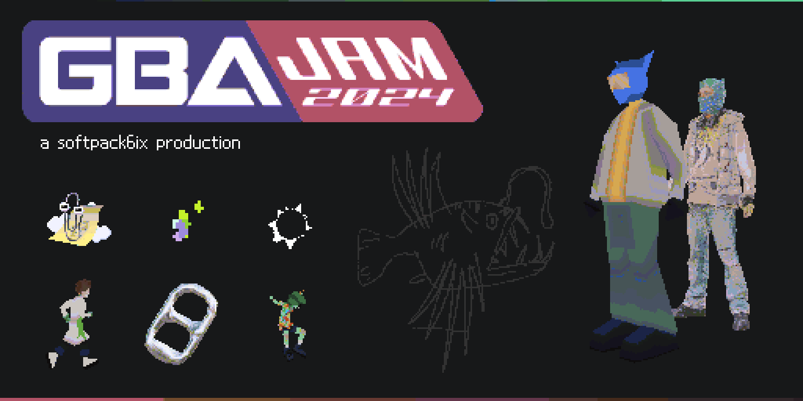

## Instructions for building 

Built using [butano](https://github.com/GValiente/butano), follow the [setup instructions](https://gvaliente.github.io/butano/getting_started.html) in their documentation.

Graphics made with [Blender](https://www.blender.org/) and  [Aseprite](https://www.aseprite.org/).

## Multiplayer
This game supports (vs and coop) multiplayer using an emulator like mGBA or Visual Boy Advance on desktop, or Pizza Boy on Android.

On real GBAs you can play multiplayer via a link cable.

## Cartridges
_Physical cartridges coming soon_.
Flashed using BennVenn's Joey Jr. V2++.

## Contributors
**Coding**: [@goudreinette](https://github.com/goudreinette), [@pierwoudstra](https://github.com/pierwoudstra)

**Music**: [y4k4r1](https://soundcloud.com/y4k4r1)

**3D models and animations**: [Lara Adriolo](https://alienheadshitkid.neocities.org/), [cyberbirdxx](https://www.instagram.com/cyberbirdxx/)

**Level design**: [dg_hoek](https://www.instagram.com/dg_hoek/), [cyberbirdxx](https://www.instagram.com/cyberbirdxx/)